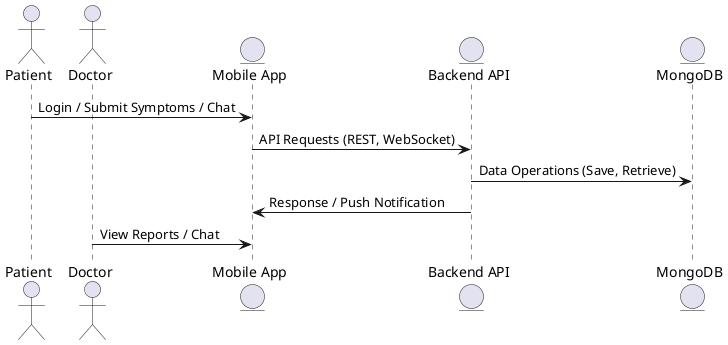

# HypoThyroManage

HypoThyroManage is a comprehensive mobile health management system designed for patients with hypothyroidism. It allows patients to track their symptoms, medication intake, and communicate with healthcare professionals in real-time. This project was developed as part of a graduation thesis and supported by the TÜBİTAK 2209-A program.

## Features

- **Multi-Role Support**: Patient, Doctor, and Admin roles.
- **Symptom Reporting**: Patients can report their symptoms weekly.
- **Medication Tracking**: Daily tracking with reminder notifications.
- **Real-Time Chat**: Encrypted, secure messaging between doctors and patients using WebSocket (Socket.IO).
- **Notifications**: Push notifications using Expo.
- **Secure Infrastructure**: HTTPS (SSL), Nginx reverse proxy, Docker-based architecture, fail2ban protection.

## Technologies

- **Frontend**: React Native (Expo), Axios, JWT Authentication
- **Backend**: Node.js, Express.js, MongoDB, Mongoose, Socket.IO
- **Infrastructure**: Docker, Nginx, Let's Encrypt SSL
- **Security**: JWT, RSA & AES encryption
- **Version Control**: Git & GitHub

## Directory Structure

```
/frontend
  - src/
  - App.js
  - package.json
  - Dockerfile

/backend
  - src/
  - services/
  - docker-compose.yml
  - Dockerfile
```

## UML Sequence Diagram

A simplified interaction flow between a patient and a doctor:



## Setup Instructions

### Frontend (React Native)

```bash
cd frontend
npm install
npm start
```

### Backend (Node.js)

```bash
cd backend
npm install
npm run dev
```

### Docker Deployment

```bash
docker-compose up --build
```

## Contributors

- Amro Mousa Ismail Baseet

## License

MIT License.
