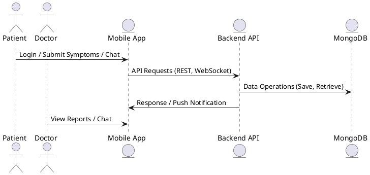

# HypoThyroManage

HypoThyroManage is a comprehensive mobile health management system designed for patients with hypothyroidism. It allows patients to track their symptoms, medication intake, and communicate with healthcare professionals in real-time. This project was developed as part of a graduation thesis and supported by the TÜBİTAK 2209-A program.

## Features

- **Multi-Role Support**: Patient, Doctor, and Admin roles.
- **Symptom Reporting**: Patients can report their symptoms weekly.
- **Medication Tracking**: Daily tracking with reminder notifications.
- **Real-Time Chat**: Encrypted, secure messaging between doctors and patients using WebSocket (Socket.IO).
- **Notifications**: Push notifications using Expo.
- **Secure Infrastructure**: HTTPS (SSL), Nginx reverse proxy, Docker-based architecture, fail2ban protection.

## Technologies

🖥️ **Frontend**  
- ⚛️ React Native (Expo)  
- 🔐 JWT Authentication  
- 📡 Axios

🛠️ **Backend**  
- 🟩 Node.js  
- 🚀 Express.js  
- 🗄️ MongoDB + Mongoose  
- 🔗 Socket.IO

🔒 **Security Enhancements**
- MongoDB user with limited `readWriteNoDrop` role
- Docker containers run as non-root users
- Environment secrets handled via `.env` file
- Healthchecks configured for both app and database containers
- `docker-bench-security` used for auditing Docker configuration

🚢 **Infrastructure**  
- 🐳 Docker  
- 🌐 Nginx  
- 🔒 Let's Encrypt SSL

## Directory Structure

```
/frontend
  - src/
  - App.js
  - package.json
  - Dockerfile

/backend
  - src/
  - services/
  - docker-compose.yml
  - Dockerfile
  - mongo-init/
```

> ✅ MongoDB initialization scripts are placed in `/backend/mongo-init/` with roles and users loaded from environment.

## UML Sequence Diagram



## Setup Instructions

### Environment Configuration

Create your `.env` file based on `.env.example`:
```bash
cp .env.example .env
```

### Frontend (React Native)
```bash
cd frontend
npm install
npm start
```

### Backend (Node.js)
```bash
cd backend
npm install
npm run dev
```

### Docker Deployment
```bash
docker-compose up --build
```

## Docker Best Practices

- Healthchecks in `docker-compose.yml`
- Non-root users in Dockerfiles
- Environment-based MongoDB initialization
- Secrets loaded via `.env`
- Docker hardening verified via Docker Bench Security

## Contributors

- Amro Mousa Ismail Baseet

## License

MIT License.
